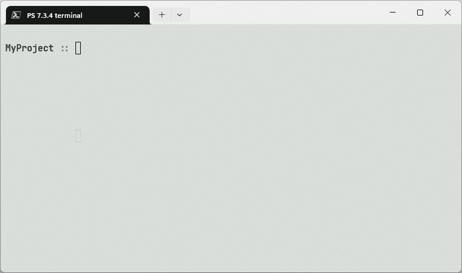

# Env


Powershell module using Create and Enable/Disable local modules with a specific format called Environments. Use it if you you want to implement some functionality applicable only for a specific location, e.g. a function `Organize-PhotosByDate` that can be stored in your `Photos` directory.

[@PowershellGallery](https://www.powershellgallery.com/packages/Env)

## Installation

```powershell
Install-Module -Name Env
```

## Usage

The module consists of functions:

- Basic operations:
    - `New-Environment [Name] [Path]` - *psenv* is used when the name is not provided
    - `Enable-Environment [Path]`
    - `Disable-Environment [Name]`
    - `Get-Environment`
    - `Test-DirIsEnv {Dir}`
- Module management:
    - `Add-EnvironmentModule {EnvironmentPath} {Module}`
    - `Remove-EnvironmentModule {EnvironmentPath} {Module}`
    - `Get-EnvironmentModules {EnvironmentPath}`

`{}` - Mandatory argument
`[]` - Optional argument

The suggested workflow is following:

1. **Create** an Environment using `New-Environment`
2. **Modify** you environment in the newly created folder as you wish
3. **Activate** the environment when you need it using `Enable-Environment`. You CAN activate several environments with unique names at once
4. **Deactivate** an environment using `Disable-Environment`. To get list of all activate environments use `Get-Environment`

## Examples

| How to...                             | Demo                                                              |
|---------------------------------------|-------------------------------------------------------------------|
|...create a new environment            |       |
|...add a new module to the environment | |
|...enable and disable the environment  |    |


## License

This work is licensed under the terms of the MIT license.

For a copy, see: [LICENSE](LICENSE)

- site:    https://agramakov.me
- e-mail:  mail@agramakov.me

## Support

[Buy me a cup of tea](https://paypal.me/4ndr/1eur)

Any amount will motivate me to develop the project. Thanks you!
